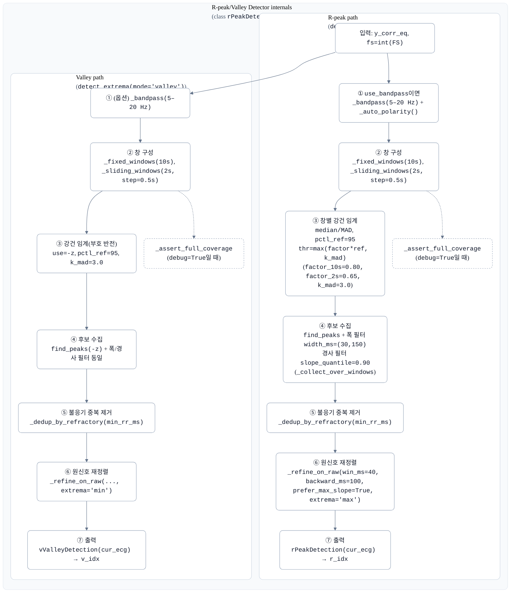

## `calibration.py` 코드 흐름도 및 상세 설명

이 코드는 크게 **4단계**로 구성됩니다.
1.  **초기화 및 데이터 로드**: UI를 설정하고 원본 신호를 불러옵니다.
2.  **1차 베이스라인 보정 (Hybrid BL++)**: `baseline_hybrid_plus_adaptive` 함수를 통해 주된 베이스라인 표류를 제거합니다.
3.  **2차 등전위선 미세 보정 (QVRi + 적응형 믹싱)**: 1차 보정 신호에 남아있는 미세한 왜곡을 P/ST 구간 중심으로 다시 보정합니다.
4.  **아티팩트 마스크 생성 및 UI 갱신**: 보정된 신호에서 문제 구간을 *탐지*하여 시각화합니다.

### 0단계: 초기화 및 데이터 로드

* **함수**: `main()`, `ECGViewer.__init__`, `ECGViewer.set_data`
* **의도**: 분석에 필요한 데이터를 불러오고 UI를 준비합니다.
* **흐름**:
    1.  `main()`에서 PyQt5 애플리케이션을 실행합니다.
    2.  `FILE_PATH`의 JSON 파일에서 `extract_ecg`로 ECG 데이터를 추출합니다.
    3.  `decimate_if_needed`: 원본 신호(예: 1000Hz)를 `FS`(250Hz)에 맞게 다운샘플링(데시메이션)합니다.
    4.  `ECGViewer` 클래스가 메인 윈도우를 생성합니다.
    5.  `set_data`가 호출되어 원본 데이터를 플롯에 설정하고, `recompute()`를 **최초로 트리거**합니다.

---

### 1단계: 1차 베이스라인 보정 (Hybrid BL++)

* **핵심 함수**: `baseline_hybrid_plus_adaptive`
* **호출 위치**: `recompute()` 함수의 가장 첫 부분
* **의도**: `problem.md`에서 지적한 **'베이스라인 표류(Baseline Wander)'를 제거**하는 것이 주 목적입니다. 이 함수는 ASLS(Asymmetric Least Squares)를 기반으로 하지만, 신호의 특성에 따라 보정 강도($\lambda$, 람다)를 '적응적'으로 조절합니다.
* **핵심 흐름**:
    1.  **초기 바닥선 (`b0`)**: `percentile_filter`로 신호의 거친 하단 경계선(baseline floor)을 추정합니다.
    2.  **QRS 보호 마스크 (`base_mask`)**: `nk.ecg_peaks` (NeuroKit2)를 사용해 R-peak를 찾아 QRS 및 T-wave 영역을 `False`로 마스킹합니다. **(의도: 베이스라인 알고리즘이 PQRST 피크를 노이즈로 오인해 깎아 먹는 것을 방지)**
    3.  **변화점 보호 (`_find_breaks`)**: `problem.md`의 **'스파이크 아티팩트'** (예: 866-875s)처럼 급격한 변화점을 찾습니다. 이 영역 또한 마스킹하여 베이스라인이 이 스파이크를 따라가지 않도록 보호합니다.
    4.  **적응형 $\lambda$ (람다) 설계 (`lam_local`)**:
        * `lam_grad`: 신호의 기울기(gradient)가 크면(급격한 변화) $\lambda$를 낮춥니다 (유연하게).
        * `lam_vol`: 신호의 변동성(variance)이 크면(노이즈) $\lambda$를 낮춥니다 (유연하게).
        * **문제점**: `problem.md`에서 지적한 대로, 노이즈가 심한 구간에서 $\lambda$가 너무 낮아지면, 알고리즘이 베이스라인이 아닌 **노이즈 자체를 따라가는 과적합(over-following)**이 발생합니다.
    5.  **세그먼트 피팅 (`baseline_asls_masked`)**: 계산된 `lam_local` 값을 기준으로 신호를 여러 조각(segment)으로 나누고, 각 조각마다 `asls_masked` (ASLS 알고리즘)를 실행하여 베이스라인을 추정합니다.
    6.  **안정화 (`b_final`)**: 추정된 베이스라인 조각들을 합치고, 저역 통과 필터(`highpass_zero_drift`, `savgol_filter`)를 적용해 최종 베이스라인(`base`)을 완성합니다.
    7.  **1차 보정 신호 (`y_corr`)**: `y_corr = y_src - base`로 원본 신호에서 1차 베이스라인을 뺍니다.

---

### 2단계: 2차 등전위선 미세 보정 (QVRi + 적응형 믹싱)

* **핵심 함수**: `_qvri_residual_isoelectric`, `roi_pchip_fill_baseline`, `roi_adaptive_mix`
* **호출 위치**: `recompute()` 함수의 중간 부분
* **의도**: 1단계에서 `y_corr`는 큰 표류는 잡혔지만, P/ST 세그먼트(등전위선)가 0점에 완벽히 맞지 않고 미세하게 왜곡되었을 수 있습니다. (`problem.md`의 **PQRST 피크 보존** 목표) 이 단계는 **등전위선(isoelectric line)을 0점으로 복원**하는 데 집중합니다.
* **핵심 흐름**:
    1.  **잔류 오프셋 제거**: `smooth_preserve_r` (R-peak 보존 스무딩) 및 `signal.medfilt` (메디안 필터)를 통해 1차 보정 신호 `y_corr`에 남아있는 잔류 표류를 한 번 더 제거하여 `y_corr_eq`를 만듭니다.
    2.  **R/V-peak 재검출**: `rPeakDetector`를 이용해 **깨끗해진 `y_corr_eq` 신호**를 기준으로 R-peak (`r_after`)와 Valley-peak (`v_after`)를 *다시* 정밀하게 찾습니다.
    3.  **보호 구간(ROI) 정의**: `build_protect_windows`로 R-peak 기준 P-wave와 ST-segment 영역(ROI)을 정의합니다.
    4.  **QVRi 기반 등전위선 추정**:
        * `_qvri_residual_isoelectric` 함수가 호출됩니다.
        * 이 함수는 `resolve.md`의 (Fasano & Villani) 논문 아이디어를 차용했습니다.
        * **의도**: 신호 전체가 아닌, **PQ 세그먼트** (R-peak 직전의 평평한 구간, 즉 '등전위선')만을 '앵커(anchor)'로 사용하여 베이스라인(`base_qvri`)을 다시 추정합니다.
        * **단, `protect_windows=wins_protect`**: P/ST 영역은 베이스라인 추정에서 제외하여(`w_protect=1e-6`), 피크가 깎이지 않도록 보호합니다.
    5.  **두 가지 보정 신호 준비**:
        * **신호 (A) `y_qvri_edge`**: `roi_pchip_fill_baseline`을 사용. QVRi로 추정한 베이스라인(`base_qvri`)이 P/ST 영역에서 붕 뜨지 않도록, P/ST 영역은 양 끝점을 PCHIP 보간(경계 보존)하여 부드럽게 채웁니다.
        * **신호 (B) `y_med_out`**: 짧은 메디안 필터(`signal.medfilt`)로 베이스라인을 추정합니다. 이 방식은 P/ST 형태 보존에 유리합니다.
    6.  **최종 적응형 믹싱 (Adaptive Mix)**:
        * `roi_adaptive_mix` 함수가 (A)와 (B) 신호를 합칩니다.
        * **ROI (P/ST) 외부**: 등전위선 복원이 잘 된 `y_qvri_edge` (A)를 주로 사용합니다.
        * **ROI (P/ST) 내부**: (A)와 (B)를 50:50으로 혼합합니다 (`gamma=0.5`).
        * **가드(Guard)**: 만약 QVRi가 P/ST 형태를 왜곡시켰다고 판단되면(상관관계가 낮으면), (B)의 비중을 높여(`g = 0.65 ~ 0.85`) 피크 형태를 보존합니다.
    7.  **최종 보정 신호**: 이 혼합된 신호가 최종 `y_corr_eq`가 됩니다.

---

### 3단계: 아티팩트 마스크 생성 및 UI 갱신

* **핵심 함수**: `suppress_negative_sag`, `fix_downward_steps_mask`, `burst_mask` 등
* **호출 위치**: `recompute()` 함수의 마지막 부분
* **의도**: 최종 보정된 `y_corr_eq` 신호에서 `problem.md`에서 언급된 **'스파이크 아티팩트'** 들이 *여전히* 남아있는지, 또는 1, 2단계 보정 과정에서 *발생*했는지 **탐지하여 사용자에게 보여주기 위함**입니다.
* **핵심 흐름**:
    1.  `recompute` 함수 상단의 주석 `Masks(Sag/Step/Corner/Burst/Wave/HV)는 PROCESSED 신호(y_corr_eq=y_corr) 기준. 보간 없음.`에서 알 수 있듯이, 이 마스크들은 **신호 수정(보간)에 사용되지 않고 오직 탐지/표시용**입니다.
    2.  `suppress_negative_sag`: 음의 방향으로 움푹 패는(sag) 구간 탐지.
    3.  `fix_downward_steps_mask`: 계단(step)처럼 신호 레벨이 뚝 떨어지는 구간 탐지.
    4.  `burst_mask`: 노이즈가 폭발(burst)하는 구간 탐지.
    5.  `high_variance_mask`: 변동성이 높은(HV) 구간 탐지.
    6.  **UI 갱신**:
        * `self.curve_corr.setData(self.t, y_corr_eq)`: 메인 플롯에 **최종 보정 신호** (노란색)를 그립니다.
        * `self.curve_base.setData(self.t, base)`: 1단계에서 제거한 **베이스라인** (파란 점선)을 그립니다.
        * `self.scatter_r_after.setData(...)`: 2단계에서 찾은 R-peak (빨간 점)을 찍습니다.
        * `self.sag_curve.setData(...)` 등: 하단 마스크 플롯에 3단계에서 탐지한 마스크들을 그립니다.

---

## 결론 및 `resolve.md`와의 관계

* `calibration.py`는 `problem.md`의 **베이스라인 표류** 문제를 1단계(`baseline_hybrid_plus_adaptive`)에서 ASLS 기반으로 1차 제거하고, 2단계(`_qvri_residual_isoelectric` + `roi_adaptive_mix`)에서 QVRi와 메디안 필터를 혼합하여 **등전위선 복원 및 PQRST 보존**을 시도하는 2-Pass 구조입니다.
* `problem.md`의 **스파이크** 문제는 1단계의 `_find_breaks`에서 *방어적*으로 처리(피팅에서 제외)하고, 3단계의 마스크 함수들로 *탐지*만 합니다.
* `resolve.md`에서 제안하는 **'스파이크 선제적 제거(modified-Z + cosh 보간)' (1단계)**와 **'PQ-군집 기반 보정' (3단계)**은 현재 `calibration.py` 코드에 **구현되어 있지 않습니다.**
* `resolve.md`의 **QVRi (2단계)**는 `calibration.py`의 2차 보정 단계에서 `_qvri_residual_isoelectric`라는 이름으로 *사용되고 있으나*, 메인 보정기가 아닌 미세 조정(refinement) 역할로 한정되어 사용됩니다.

---

### 메인 파이프라인
### 메인 파이프라인

```mermaid
%%{init:{
  "theme":"base",
  "themeVariables":{
    "primaryColor":"#ffffff","secondaryColor":"#ffffff","tertiaryColor":"#ffffff",
    "primaryTextColor":"#111827","primaryBorderColor":"#CBD5E1","lineColor":"#64748B",
    "fontFamily":"Inter, Noto Sans KR, Arial, sans-serif"
  },
  "flowchart":{"useMaxWidth":true,"nodeSpacing":22,"rankSpacing":30}
}}%%
flowchart LR

%% LEFT: Main pipeline
subgraph LEFT_PANEL[ ]
direction TB

  A["① <code style='color:#0f172a'>extract_ecg</code><br/>입력 ECG 추출"]
  B["② <code style='color:#0f172a'>decimate_if_needed</code><br/>리샘플(0-phase FIR)"]
  A --> B

  subgraph Baseline_and_Centering["Baseline & Centering<br/><span style='color:#475569'>(baseline/*)</span>"]
  direction TB
    C["③ <code style='color:#0f172a'>baseline_hybrid_plus_adaptive</code><br/>적응형 기준선·QRS인지·단절보호"]
    D["④ <code style='color:#0f172a'>smooth_preserve_r</code><br/>R-피크 보존 평활"]
    E["⑤ <code style='color:#0f172a'>median_center</code><br/>잔류 오프셋 제거"]
    C --> D --> E
  end

  F["⑥ <code style='color:#0f172a'>rPeakDetector</code><br/>R-peak / valley 검출"]
  G["⑦ <code style='color:#0f172a'>build&#8203;_protect&#8203;_windows</code><br/>QRS 보호 ROI 생성"]
  E --> F --> G

  subgraph QVRi_and_ROI["QVRi & ROI<br/><span style='color:#475569'>(roi/*, qvri/*)</span>"]
  direction TB
    H["⑧ <code style='color:#0f172a'>_qvri&#8203;_residual&#8203;_isoelectric</code><br/>PQ 기준선 복원 (isoelectric)"]
    I["⑨ <code style='color:#0f172a'>build_roi_windows</code><br/>→ <code style='color:#0f172a'>roi&#8203;_pchip&#8203;_fill&#8203;_baseline</code><br/>P/ST 경계 보존 보간 (PCHIP)"]
    J["⑩ <code style='color:#0f172a'>short_median</code><br/>ROI용 짧은 메디안"]
    K["⑪ <code style='color:#0f172a'>roi&#8203;_adaptive&#8203;_mix</code><br/>신뢰도 기반 혼합 (QVRi↔Median)"]
    H --> I
    H --> J
    I --> K
    J --> K
  end

  L["⑫ <code style='color:#0f172a'>y_corr_eq</code><br/>최종 보정 ECG"]
  K --> L
end

%% RIGHT: Optional / Diagnostic
subgraph OPTIONAL_PANEL["Optional / Diagnostic<br/><span style='color:#475569'>(masks/*, denoise/*)</span>"]
direction TB
  HUB(("diagnostic"))

  M1["<code style='color:#0f172a'>suppress&#8203;_negative&#8203;_sag</code><br/>네거티브 처짐 억제"]
  M2["<code style='color:#0f172a'>fix&#8203;_downward&#8203;_steps&#8203;_mask</code><br/>하강 스텝 보정"]
  M3["<code style='color:#0f172a'>smooth&#8203;_corners&#8203;_mask</code><br/>코너 완화"]
  M4["<code style='color:#0f172a'>burst&#8203;_mask</code><br/>도함수 버스트 억제"]
  M5["<code style='color:#0f172a'>qrs&#8203;_aware&#8203;_wavelet&#8203;_denoise</code><br/>웨이블릿 디노이즈"]
  M6["<code style='color:#0f172a'>high&#8203;_variance&#8203;_mask</code><br/>고분산 마스크"]

  HUB -.-> M1
  HUB -.-> M2
  HUB -.-> M3
  HUB -.-> M4
  HUB -.-> M5
  HUB -.-> M6
end

L --> HUB

classDef step fill:#ffffff,stroke:#94A3B8,rx:8,ry:8;
classDef op   fill:#ffffff,stroke:#94A3B8,stroke-dasharray:3 3,rx:8,ry:8;
classDef hub  fill:#ffffff,stroke:#94A3B8,stroke-width:1px;

class A,B,C,D,E,F,G,H,I,J,K,L step;
class M1,M2,M3,M4,M5,M6 op;
class HUB hub;

style LEFT_PANEL fill:#ffffff,stroke:#CBD5E1,stroke-width:1px,rx:10,ry:10
style Baseline_and_Centering fill:#F8FAFC,stroke:#E2E8F0,rx:10,ry:10
style QVRi_and_ROI fill:#F8FAFC,stroke:#E2E8F0,rx:10,ry:10
style OPTIONAL_PANEL fill:#ffffff,stroke:#CBD5E1,stroke-width:1px,rx:10,ry:10
```

**근거 라벨 / References**

* `QVRi` 단계: **[Fasano & Villani 2015]** — *ECG Baseline Wander Removal with Recovery of the Isoelectric Level* (결절점/가중 최소변동, 등전위 복원).
* `PQ ROI 기반 등전위 보정/검증` 아이디어: **[Le et al. 2019]** — *isoelectric bias from PQ cluster (R-left)*.
* `스파이크/페이싱 아티팩트` 자동 제거(옵션 단계의 배경): **[Harvey et al.]** — *Automated Pacing Artifact Removal in Electrocardiograms* (수정 Z-score, 하이퍼볼릭 코사인 보간).

> 현재 코드에서는 스파이크 보간과 Residual-Refit이 **기본 비활성**이며, 마스크들은 **시각적 진단/선택적 처리용**으로 표시됩니다.

---

### 서브도식 — R-peak/Valley 검출 내부 (rPeakDetector)

---

### Config/기본값 (하단 메모)

* **Sampling**: `FS_RAW≈1000 Hz` → `FS=250 Hz` (`decimate_if_needed`, FIR zero-phase).
* **Hybrid BL++** (`baseline_hybrid_plus_adaptive`):

  * `ASLS_LAM=8e7`, `ASLS_P=0.01`, `ASLS_DECIM=8`, `verylow_fc≈0.55 Hz`,
  * Adaptive λ(gradient/variance), λ-floor, break hard-cut(`BREAK_PAD_S≈0.30`),
  * RR-cap(`RR_T0_MS=80`, `RR_T1_MS=320`, `RR_EPS_UP/DN`).
* **QVRi pins / 보호 ROI**:

  * Pins: PQ `t0=-240 ms` ~ `t1=-100 ms`, stride=2, `lam≈2000`, `pin_strength=1e9`.
  * 보호 ROI: P `−220…−100 ms`, ST `+120…+260 ms`.
* **Median**: P/ST 보존용 `~0.4–0.6 s` (`kernel_size=101 @250 Hz`).
* **Masks(옵션)**: `SAG_WIN_S=1.0`, `SAG_K=3.5`, `STEP_SIGMA=5.0`, `CORNER_L_MS=140`,
  `BURST_WIN_MS=140, BURST_KD=5.0, BURST_KS=2.5`, `HV_WIN=2000, HV_KSIGMA=4.0`.
* 이 값들은 `calibration.py`의 `DEFAULTS` 및 각 함수 인자에서 관리.

---
